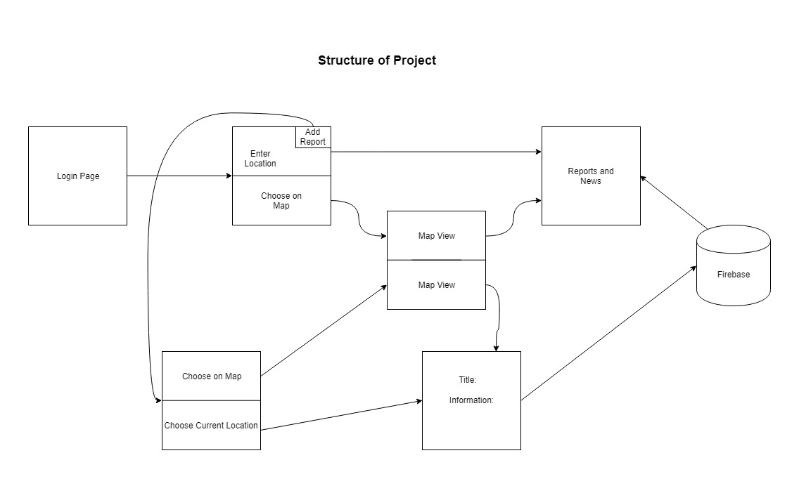
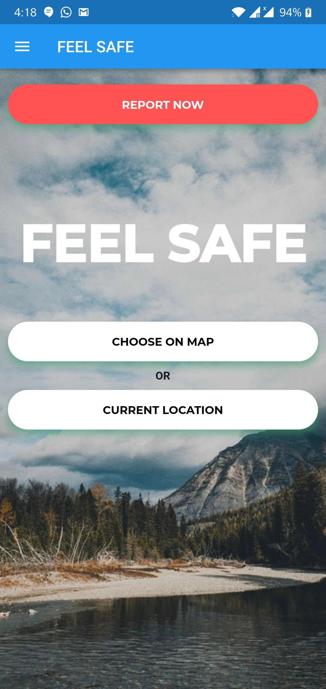
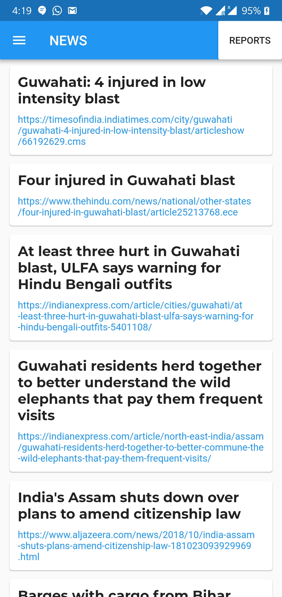
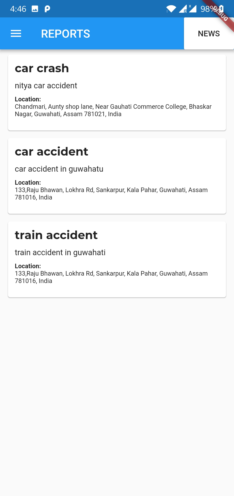
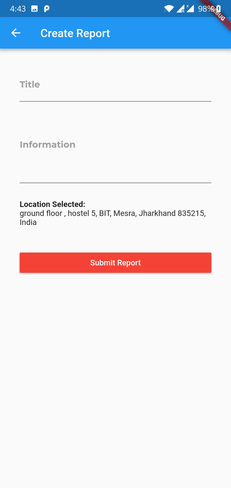
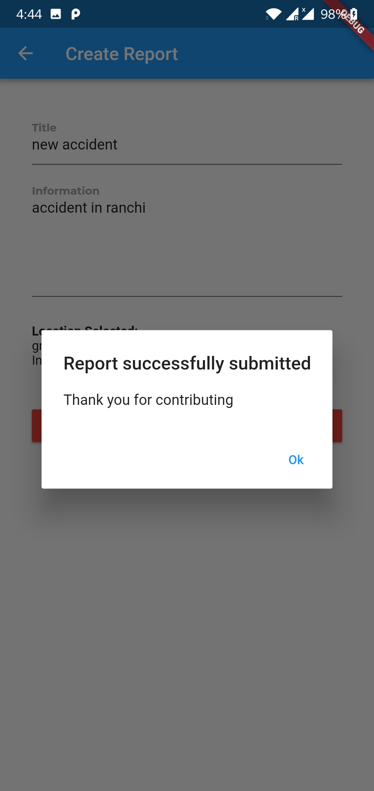

# bughopper

The main idea behind this project is to allow people to get a brief idea about the previously happened accidents and crimes of place or a locality that is unknown to him/her. Through this app, one can know about the mishappenings that may have taken place at a particular location just by letting the app know of the location. If the user happens to observe any mishappening in any place, he can report that event though the app. The report is stored in an online database and also corresponding to the type of incident that has taken place, the nearby police station or hospital can be alerted so that quick action can be initiated.
    

## Tools and technologies used:  
    
    Flutter, Firebase and Dart.

## How to Run:
    
To run the project:  

1. Clone the repository and navigate inside its directory.  

            $   git clone https://github.com/hackabit18/bughopper
            $   cd bughopper
            
2. Run the following command while connecting a android device to the computer in debug mode:  

            $   flutter run

* Note: The phone no. in the lib/pages/createReport.dart needs to be added in order to send the report to particular number.

##  About the app:

Feel Safe is a mobile app for getting know of situations around an unknown locality. It gives us the collection of all the mishaps that has occured in that locality in the last few months and gives the user a idea of how safe the place is.
Moreover it has the functionality of reporting crimes and accidents directly from the app with the click of a button. The reporter has to give a brief description of the incident and a report is send to the nearest police station (and hospital if needed).

  

  

    

### Main features: 

#### 1. Information about a place

A person can know about the mishaps of the locality that is not know to him/her.  

This can be done by 2 ways -

1. Marking the location on the map - 

The app shows the information about the place marked in the map.

  

2. Current location - 

The app shows information about the current locality.

The report generated has the news of the mishaps that occured in last few months and also the reports sent by various users about the mishaps.

    

  

#### 2. Reporting

A person can report about a crime/accident by writing a short description of it.

1. Current Location reporting - 

  

  

2. Mark on map - 

  

  

Once the report is submitted, a notification is sent to the police(and hospital if needed).

 

## Future Scope:

1. The app currently sends the message to and individual, but with updated database of all the police stations and hospitals it could be more efficient.

2. With more and more people using it, the data of the mishaps would be could be updated to a large extent.

3. Currently the reporter's details are shared with the police to avoid fake reports but that can be improved by making the reporter anonymous (as people donot want to be involved in the process of police investigation).

## License:

Anyone who has access to our repository is free to use this software in any form. This project is entirely open source.
